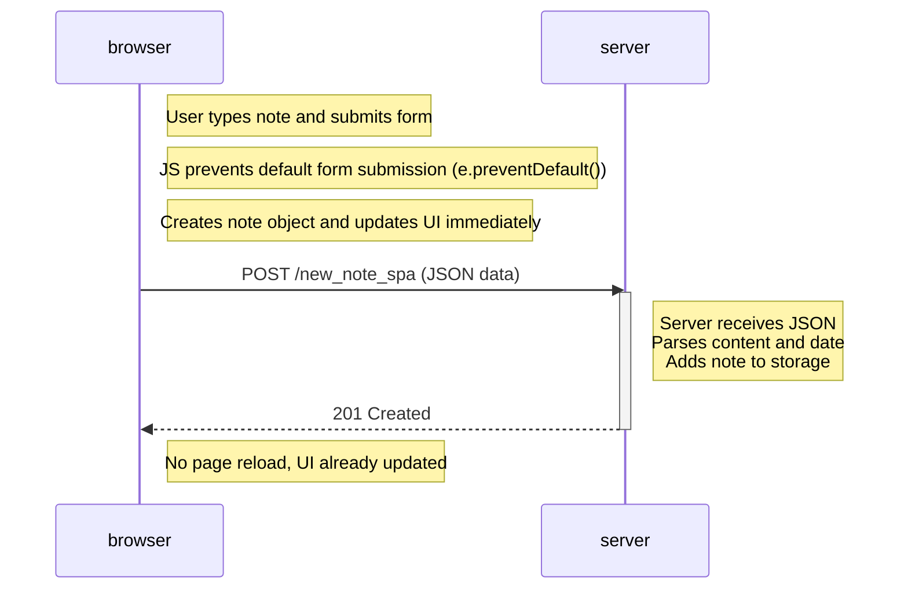

# 0.6: New note in Single page app diagram

## Explanation

In the SPA version, submitting a new note is handled entirely by JavaScript. When the user submits the form, the default browser behavior is prevented using `e.preventDefault()`, so no page reload occurs.

The JavaScript creates a new note object, updates the UI immediately by adding the note to the list, and then sends the data to the server using an asynchronous POST request (`XMLHttpRequest`) in JSON format.

The server processes the request, stores the new note, and responds with a `201 Created` status. Since there is no redirect and no additional requests, the browser stays on the same page. This makes the interaction faster and smoother compared to the traditional approach.
